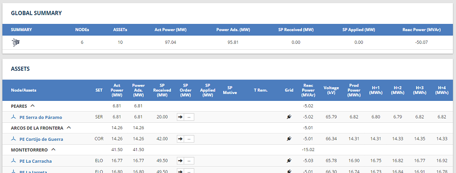

# Objetivo
El objetivo de este módulo es mostrar una visión global de todos los assets de un sistema y los datos que se envían/reciben por parte de REE

# Funcionalidades
El módulo se basa en el anterior módulo Summary:



## Señales a mostrar
El anterior módulo se mostraba un resumen de centro de control en la sección "Global Summary" estos datos deben moverse a la cabecera lateral
* Número de Assets del Centro De Control
* Potencia activa todal del Centro De Control
* SP Recibido total
* SP Aplicado total

En la tabla de la derecha deben mostrarse las siguientes señales
* [PARK|SOLAR|HYDRO]
    * ActivePower
    * Marca de que la instalación está adscrita
    * SP Received
    * SP Motive
    * SP Applied Grid Connection
    * ProduciblePower
    * H1Energy
    * H2Energy
    * H3Energy
    * H4Energy

En función de si una instalación es Parque eólico, huerto solar o central hidraulica, el icono de la fila debe ser distinto

## Funcionalidades
### Mostrar setpoint de centro de control activo
En la recepción de setpoint intervienen las siguientes señales
* [Asset].CECOELSetpointReceived
* [Asset].CECOELSetpointMotive
* [Asset].CECORESetpointReceived
* [Asset].CECORESetpointMotive
* CCR.RoleReceived

En función del rol se decide que setpoint hay que mostrar siguiendo la siguiente lógica

```
SetpointAMostrar = (CCR.RoleReceived == 1)? mostrar cecore : mostrar cecoel
```


### Recepción de setpoint
El módulo debe representar cuando llega un setpoint desde REE, para ello mostrará con un color distinto las celdas de setpoint y motivo.
La lógica es la siguiente:

```
Si SPMotive != 0 => Cambiar el estilo de la celda a naranja
```

### Envio de setpoints
En los assets que esten configurados debe permitir el envio de setpoints, el envío de setpoint se realizará escribiendo en la señal __SetpointRequest__