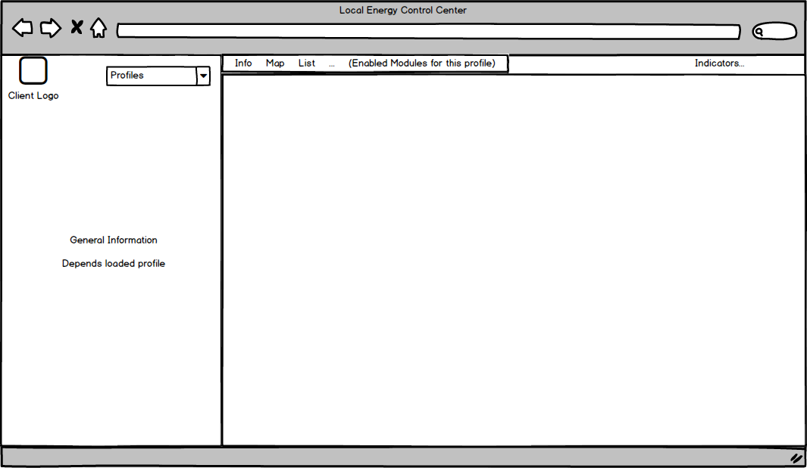

# Análisis técnico
##Objetivo
El proposito de este documento es definir la tecnología en que se desarrollará la nueva aplicación web "Local Energy Control" y los requisitos que debe cumplir

##Requisitos
1. Los frameworks usados deben tener el mínimo número de dependencias externas para que la aplicación web sea rapida de descargar

2. Será una SPA (Single Page Application) esto implica que:
    * Se hará la carga inicial de una plantilla sobre la que se irá cargando/descargando el contenido dinámicamente desde el cliente
    * El enrutado de páginas se hará en el cliente (client-side routing)
    
3. Se usará el backend ya desarrollado de CompactSCADA
    * CompactSCADA-WebServer en el lado del servidor
    * compactscada.ts en el lado del cliente
    
4. El sistema de login (usuarios, claims) será el usado actualmente

5. Usaremos los frameworks ya usados anteriormente
    * Ractive.js
    * Page.js
    
    
 ## Tasks
 1. Implementar una aplicación web que realice lo siguiente
    * Cargue la pantalla de login
    * Cuando el usuario se logue correctamente cargue el contenedor principal    
        
        * En función del claim o claims del usuario
            * Cargará en el combo profiles, los claims del usuario
            * Cargará en el menu los módulos que puede acceder
            * Cargará los indicadores que tenga acceso
    * Cuando se cargue un módulo
        * Cargue su plantilla Ractive y la renderice
    * Cuando se navegue entre módulos cargue/descargue la plantilla Ractive y los recursos necesarios